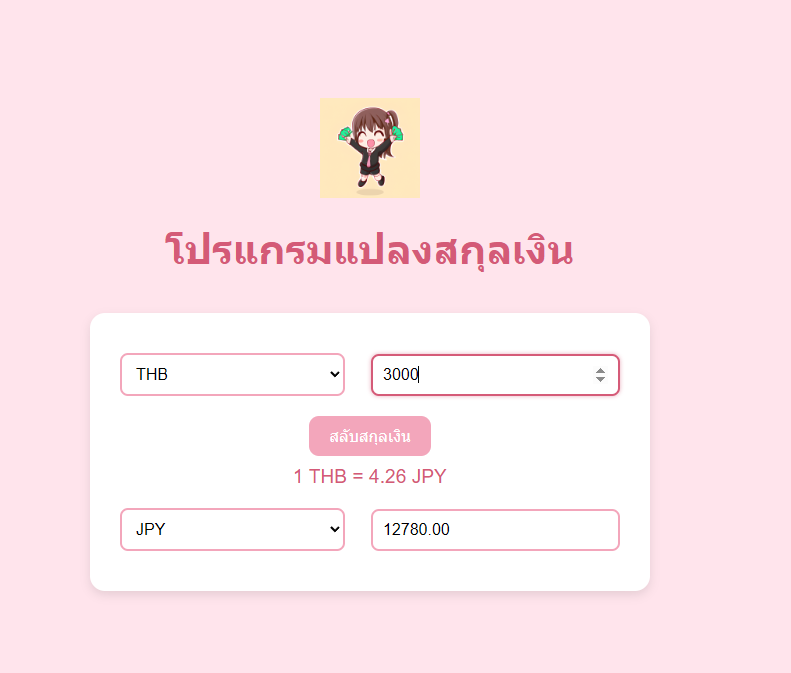

# 💱 Currency Converter

A simple web-based currency converter built using **HTML**, **CSS**, and **JavaScript**.  
It allows users to convert currencies in real-time using live exchange rates from the [ExchangeRate API](https://www.exchangerate-api.com/).

## 🌐 Features

- ✅ Real-time exchange rates
- 🔄 Swap currencies easily
- 📱 Simple design
- 🔧 Built with vanilla JavaScript (no frameworks)

## 📸 Preview

<p align="center">
  
</p>

## 🚀 How to Use

1. Clone or download this repository:
   ```bash
   git clone https://github.com/Chinorin/Currency-Converter-with-JS.git
2.Open index.html in your browser.

3.Select your currencies and enter an amount to convert.   
